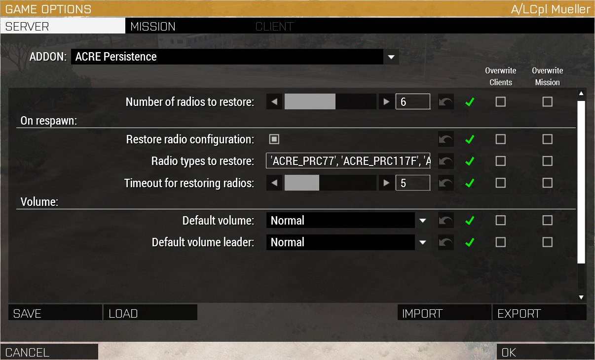

# ACRE-Persistence
Save your radio configuration between missions and restore it automatically upon respawn.

## Features
- Save and load your radio configuration between sessions
- Restore radio configuration on respawn
- Configure default direct speech volume for group leaders and players

## Requirements
- CBA
- ACRE
- ACE
  
## Download
[Steam workshop](https://steamcommunity.com/sharedfiles/filedetails/?id=3043180500)  
[Github](https://github.com/16AA-Milsim/ACRE-Persistence/releases)  

## Usage
Detailed instructions can be found in the diary section on the map screen.

### Configuration
All configuration is done via CBA settings.

### Limitations
- The power state of radios cannot be saved or restored, if you'd like to disable radios turn their volume to 0.
- The radio configuration data is specific to your used Arma 3 profile, if you switch profiles it won't be available.

## FAQ
#### Is this a clientside mod?
Yes, it's an optional clientside mod because everything runs locally on the player.

#### Can I include this mod in our repacked modpack?
If you really want to, yes. But you will have to provide the full source of your modpack as mandated by this mods [GPLv3 license](/LICENSE). If you're worried about the 25 mods limit in the Arma launcher, increase your [steamProtocolMaxDataSize](https://community.bistudio.com/wiki/Arma_3:_Server_Config_File) in your server.cfg file. Makes your life easier and mine.

#### Will this create any radios?
No, it only restores the radios configuration, if you are missing radios it will attempt to restore as much as possible.

#### Will this break ACRE?
It *shouldn't*, 16AA has been running a script version of this for about a year now without any issues. We are only using documented, public ACRE functions and are not copying any radio IDs.

#### How do I report bugs?
Head to the [Issues tab](https://github.com/16AA-Milsim/ACRE-Persistence/issues/new) and fill out the template! Include as much detail as possible so we can reproduce the bug.

## Contribute

This mod uses [HEMTT](https://github.com/BrettMayson/HEMTT). Download the latest .exe and add it to this repo or to your PATH.  
Thanks to @TACHarsis for providing a [mod template](https://github.com/TACHarsis/hemtt-mod-template) that got all this started.  
The default speech volume functionality has been provided by @3Mydlo3 at [ArmaForces](https://armaforces.com/), thanks for that!  

    build.bat           - to build without signing. Will build into '.hemttout\build' directory.
    build_dev.bat       - to build dev version, set up for file patching with associated softlinks. Will build into '.hemttout\dev' directory.
    build_release.bat   - to build ready for release with signing.  Will build into '.hemttout\release' directory.

## Images

  
Performance Impact

  
 Performance metrics have been extracted with Dedmens [ArmaScriptProfiler](https://github.com/dedmen/ArmaScriptProfiler).  
 Generally server FPS should not be affected, all functions are run on the client/player. There are no continuous function running so gameplay impact is minimal.  
 Client FPS will briefly dip on spawn in (when the initial direct speech volume is adjusted), on respawn (when the radio configuration is copied from your corpse and applied) and whenever you manually save or restore the radio config to your ProfileNamespace.  
 Game startup time will increase by approximately 7 ms because of function compiling.  

 The following will show some average function runtimes, measured with a Ryzen 5 5600X@4.5 Ghz and 32GB@3200Mhz RAM.  

   
 First columns lists the script name, the second the file location of the script and if applicable the line number and the third column the sum of all script runtimes.  
 In column 4 is the script counter, showing how often script has run in the captured timeframe, column 5 MTPC displays the **Mean Time Per Call**, so how long on average a script runs.  

 `l6AA_acre_XEH_preStart` is the function compile on game startup, it only runs once and increased load time by 6.7 ms.  
 `l6AA_acre_fnc_adjustVoiceVolume` adjusts the direct speech volume after spawn in, it runs multiple times checking if the player is initialized fully (that's the 38 counts) and then completes it's run. It will increase the length of 38 frames by roughly 118.33 μs which would lower your FPS from 50 to 49.53 until the script completes or times out after 5 seconds.  
 `l6AA_acre_fnc_restoreRadiosOnRespawn` runs on every respawn, copying the radio configuration from your corpse and applying it to your new radios. It wil lower your FPS from 50 to 49.98 for a single frame.
 `l6AA_acre_fnc_saveRadioSettings` saves your radio configuration to your ProfileNamespace so you can restore it sometime else. It is quite FPS intensive because it writes to a file (`vars.Arma3Profile`), it will lower your FPS from 50 to 46.5 for a single frame.  
 `l6AA_acre_fnc_restoreRadioSettings` is similar, it has to read from a file and then restore the radio configuration. It will lower your FPS from 50 to 42.8 for a single frame.  
 `l6AA_acre_fnc_showSavedRadioSettings` also needs to read from a file and then display your saved settings. It will lower your FPS from 50 to 48.8 for a single frame.    
  

